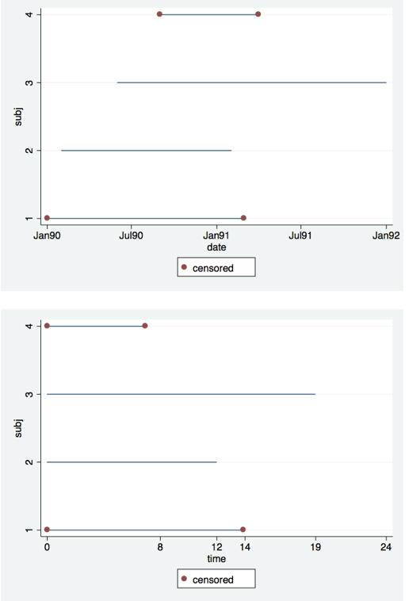
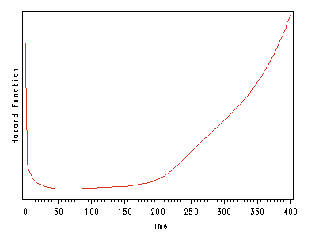
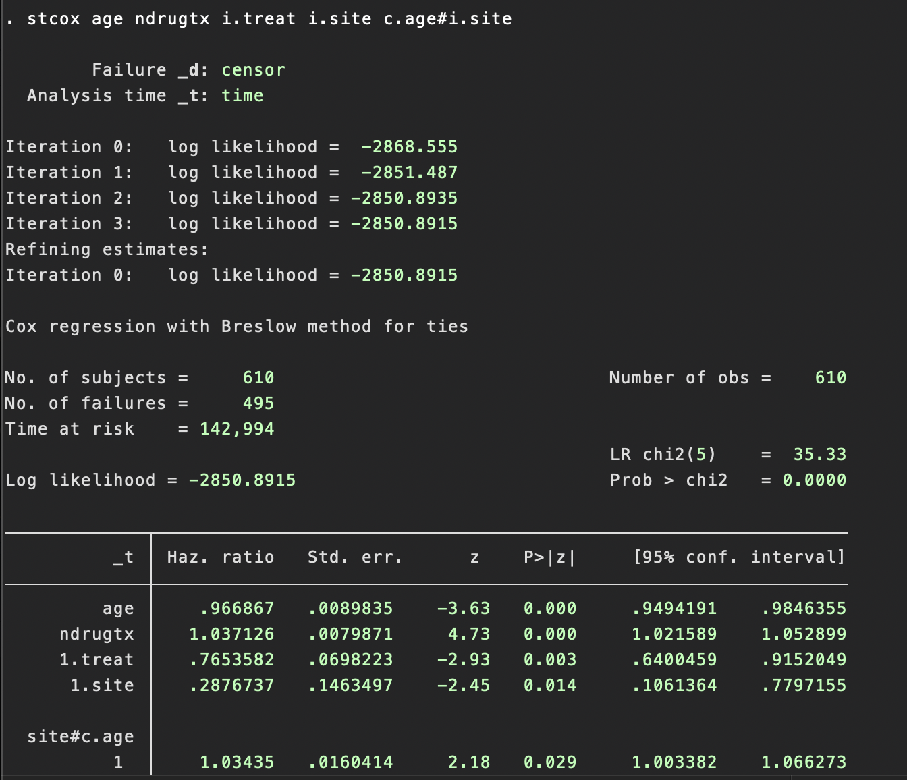
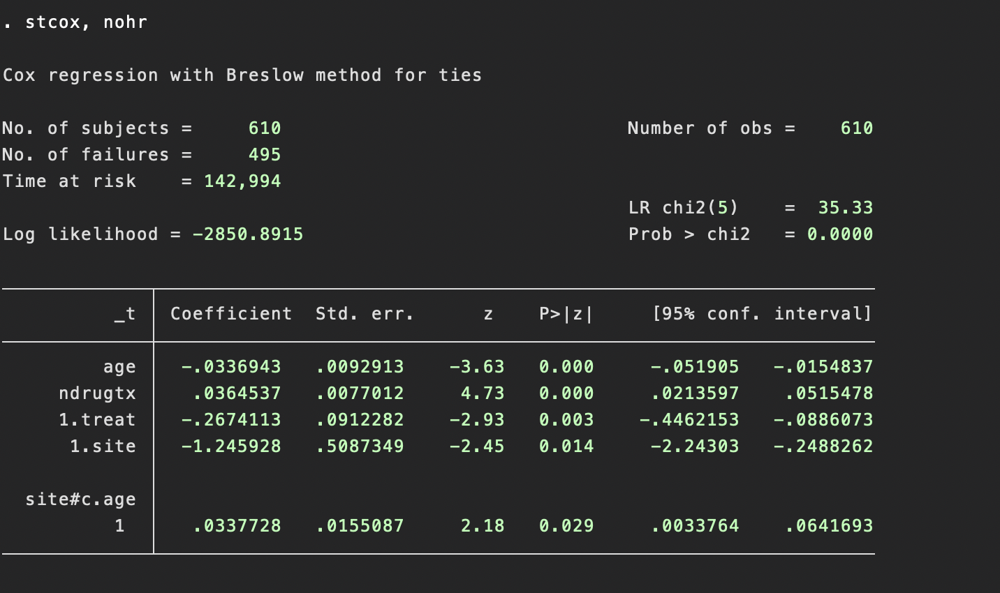

# Part 1: Concepts

El survival analysis o **duration model** es un análisis de tiempo hasta la ocurrencia de un evento. Algunos ejemplos en ciencias sociales

- Cambios de empleo
- Duración de matrimonios
- Nacimiento de hijos

## **Desafíos**

La **censura** y la **no normalidad** producen dificultades al tratar de analizar los datos utilizando OLS.

1. Censura: ocurre cuando hay una observación con información incompleta (no info en $X$ e $Y$. Como comentamos en la ayudantía pasada, la censura se puede posicionar a la derecha, izquierda o al medio. 

La mayoría de los datos utilizados en estos análisis tienen *censura derecha*.

- Cuando una observación está censurada a la derecha, significa que la información es incompleta porque el sujeto no tuvo un evento durante el tiempo que el sujeto formó parte del estudio.
  
- El punto del análisis de supervivencia es seguir a los sujetos a lo largo del tiempo y observar en qué momento experimentan el evento de interés. A menudo sucede que el estudio **no abarca suficiente tiempo para observar el evento para todos los sujetos en el estudio**.

  - Abandonen el estudio por razones no relacionadas con el estudio
  - El estudio termina
  
Assumption: si el sujeto hubiera podido permanecer en el estudio, entonces hubiera sido posible observar eventualmente el tiempo del evento.
  
## **Different times (calendar and study)**

  
  
## **Hazard Rate en los duration models**

En *tiempo discreto* (meses, años, etc) **hazard rate** es la probabilidad de que un individuo experimente un evento en el tiempo $t$ mientras ese individuo está en riesgo de enfrentar un evento, siendo esta rate **no observada** (considera ocurrencia y momento). 

Si la **hazard rate** es constante

- Una hazard rate = 1.5 $\Longrightarrow$ se esperaría que ocurrieran 1.5 eventos en un intervalo de tiempo de una unidad de longitud.

- Una hazard rate = 1.5 y 3 en tiempo $t$ $\Longrightarrow$ el riesgo de un evento de del segundo caso sería dos veces mayor en el tiempo $t$.

## **Survival function y determinantes**

- Hazard rate y survival function

- ¿Cómo es influida por otros determinantes?

- Example de transplantes: riesgo de la cirugía, comorbilidades, deterioro, etc.

# Part 2: Empirical exercise

## Set up

Estudiaremos el tiempo de re-incidencia  al consumo de drogas para pacientes inscritos en dos programas de tratamiento residencial diferentes que difieren en duración

- *treat=0* es el programa corto y *treat=1* es el programa largo.

- Los pacientes fueron asignados aleatoriamente a dos sitios diferentes (*site=0* es el sitio A y *site=1* es el sitio B).

- *age* indica la edad al momento de la inscripción

- *herco* indica el uso de heroína o cocaína en los últimos tres meses (*herco=1* indica uso de heroína y cocaína, *herco=2* indica uso de heroína o cocaína, y *herco=3* indica que no se consumió heroína ni cocaína)

- *ndrugtx* indica el número de tratamientos previos para la drogadicción.

- *time* contienen el tiempo hasta el retorno al consumo de drogas

- *censor* indica si el sujeto regresó al consumo de drogas (*censor=1* indica retorno al consumo de drogas y *censor=0* de lo contrario).
  
## Explore data

- **Visualización de las primeras 10 observaciones del conjunto de datos UIS**

  - Veamos las primeras 10 observaciones del conjunto de datos UIS. Tenga en cuenta que el sujeto 5 está censurado y no experimentó un evento mientras estuvo en el estudio. También tenga en cuenta que la codificación para *censor* es bastante contraintuitiva, ya que el valor 1 indica un evento y 0 indica censura. Quizás sería más apropiado llamar a esta variable "evento".
  
  
## Descriptive analysis

- Gran idea realizar un análisis univariado antes de proceder a modelos más complicados.

- Curvas de Kaplan-Meier para todos los predictores categóricos: proporcionará información sobre la forma de la survival function para cada grupo y dará una idea de si los grupos son proporcionales (es decir, las funciones de supervivencia son aproximadamente paralelas).

- Otros:  log-rank (qualitative regressors) y Cox regression (quantitative regressors).

  
- **_treat_**
  - No son perfectamente paralelas, pero se separan excepto al principio y al final.
  

**Remember**

Las curvas de Kaplan-Meier muestran la proporción de sujetos que **aún no han experimentado el evento de interés en función del tiempo**. En cualquier punto dado en el tiempo, la curva representa la proporción de sujetos que aún están "vivos" o sin experimentar el evento.

Si las curvas de dos grupos diferentes:

- Están completamente superpuestas, significaría que las tasas de supervivencia en ambos grupos son exactamente iguales en todos los puntos en el tiempo.

- Si son paralelas, las tasas de supervivencia son constantes para ambos grupos 

  
### **Modelo**

(see STATA)

### **Mirando las hazard rate**

a. A medida que el número de tratamientos de drogas previos (*ndrugtx*) aumenta en una unidad, y todas las demás variables se mantienen constantes, la tasa de recaída aumenta en un 3.7% (100%-103.7%)

b. Si la duración del tratamiento se modifica de corta a larga (*treat*), mientras se mantienen constantes todas las demás variables, la tasa de recaída disminuye en (100% – 76.5%) = 23.5%.

c.  A medida que el tratamiento se traslada del sitio A al sitio B (*site*) y con edad cero, y todas las demás variables se mantienen constantes, la tasa de recaída disminuye en (100% – 28.8%) = 71.2%.

### Interacciones

a.  **Sujetos en sitio A (sitio=0), 5 años más**
Harzard rate es  a $exp(-0.03369*5) = .84497351$. Por lo tanto, la tasa de re-incidencia disminuye en (100% – 84.5%) = 15.5% con un aumento de 5 años en la edad.

- **Comparación de 2 sujetos dentro del sitio B (sitio=1)**
  - Un aumento en la edad de 5 años mientras se mantienen constantes todas las demás variables produce un cociente de peligro igual a $exp(-0.03369*5 + 0.03377*5) = 1.0004$.

Por lo tanto, la tasa de re-incidencia se mantiene bastante estable para los sujetos en el sitio B ya que 1.0004 está muy cerca de 1.

  
  
##  **Proportional assumption**

La **proporcionalidad** establece que el efecto de una variable independiente sobre la hazard rate de experimentar un evento es **constante a lo largo del tiempo**. En otras palabras, este supuesto implica que la relación entre las variables independientes y la survival function es constante en el tiempo.

Este supuesto puede ser violado cuando el efecto de una variable independiente cambia **a lo largo del tiempo**. 

Métodos para verificar que un modelo cumple con la suposición de proporcionalidad

1. Inclusión de covariates *dependientes del tiempo* en el modelo utilizando las opciones *tvc* y *texp* en el comando *stcox* (basicámente son los regresores interactuados con el tiempo)

2. Residuos de Schoenfeld, que es una post-estimación de *stcox*. Usamos el comando *stphtest* y *stphplot*. 

Si las pruebas en la tabla no son significativas entonces no podemos rechazar la proporcionalidad. Una línea horizontal en los gráficos es una indicación adicional de que no hay violación de la suposición de proporcionalidad. 

#### ¿Qué hacer en caso de que no se cumpla proporcionalidad?

1. Inclusión de variable dependiente del tiempo para los predictores no proporcionales.

2. Estratificar en el predictor no proporcional (argumento *strata* en *stcox*).

## **Survival functions**

- Cada patrón de covarites tendrá una **survival function diferente**. 

**Example 1**

Individuo que tiene 30 años de edad ($age = 30$), ha tenido 5 tratamientos previos para drogas ($ndrugtx=5$) y actualmente está recibiendo el tratamiento largo ($treat=1$) en el sitio A ($site=0$ y $agesite=30\times = 0$).

**Steps**

1. Base survival (regressors == 0)
2. Elevamos la survival function con la combinación lineal de los coeficientes 
3. La combinación lineal sería: $-0.0336943*30 + 0.0364537\times5 – 0.2674113\times1 – 1.245928\times0 – .0337728\times0$

4. También podemos comparar las funciones de supervivencia de diferentes grupos. 

